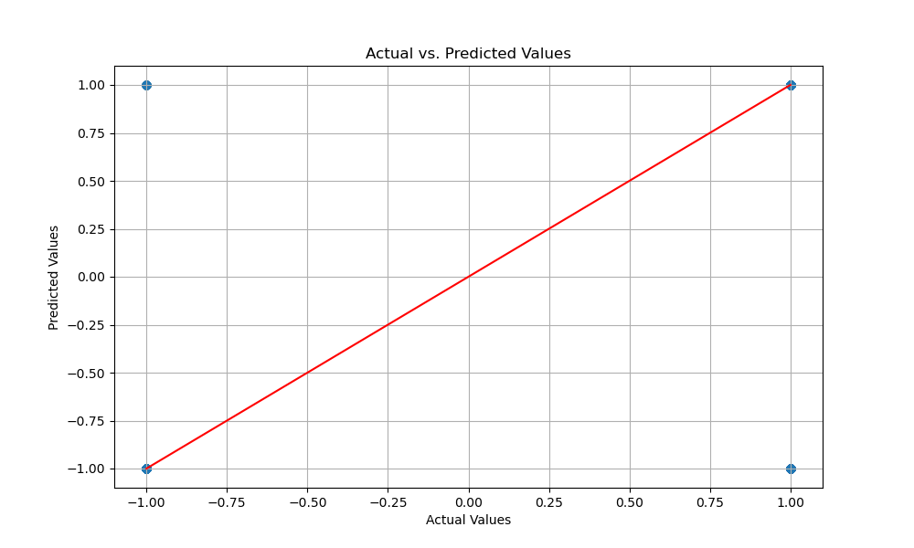
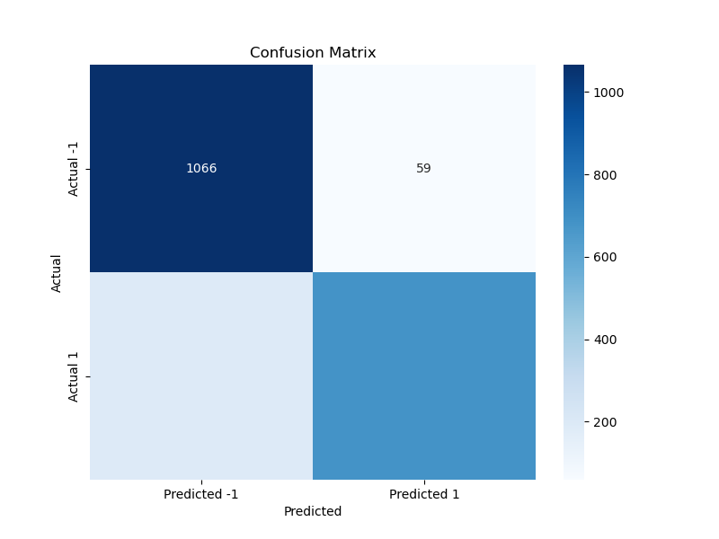

# Linear Regression Model Analysis

This project implements a linear regression model to analyze and predict labels from a dataset. It includes the calculation of accuracy, confusion matrix, and economic gain, along with graphical representations of the model's performance using Matplotlib and Seaborn.

## Table of Contents
- [Installation](#installation)
- [Usage](#usage)
- [Results](#results)
- [Contributing](#contributing)
- [License](#license)

## Installation
## Project Structure
├── data
│ └── hw3.data1.csv.gz
├── images
│ ├── actual_vs_predicted.png
│ └── confusion_matrix.png
├── linearM.py
└── README.md

## Requirements

- Python 3.11
- pandas
- numpy
- matplotlib
- seaborn
- scikit-learn
  
### Prerequisites
- Anaconda/Miniconda
- Python 3.11

### Setting Up the Environment
1. **Clone the Repository**:
    ```bash
    git clone https://github.com/yourusername/linear-regression-analysis.git
    cd linear-regression-analysis
    ```

2. **Create a Conda Environment**:
    ```bash
    conda create --name linear_regression_env python=3.11
    conda activate linear_regression_env
    ```

3. **Install the Required Libraries**:
    ```bash
    conda install pandas numpy scikit-learn matplotlib seaborn
    ```
3. **Ensure the 'images' directory exists:**:
    ```bash
    conda mkdir -p images
    ```
## Data
Place your hw3.data1.csv. file in the data directory.


3. **Running the Code:**:
   ## To execute the analysis, run the linearM.py script:
    ```bash
    python linearM.py
    ```
##The script will:

Load and preprocess the data.
Split the data into training and testing sets.
Define the linear model coefficients and intercept.
Predict the labels using a linear model with an adjustable threshold.
Find the best threshold to minimize economic loss.
Calculate and print the accuracy, confusion matrix, economic loss, and best threshold.
Save and display plots for actual vs. predicted values and the confusion matrix.

## Usage

1. **Place your dataset (`hw3.data1.csv`) in the project directory**.
2. **Run the script**:
    ```bash
    python linearM.py
    ```

## Results

### Accuracy and Confusion Matrix
The script prints the accuracy of the model and displays the confusion matrix along with the economic gain calculated based on the given cost parameters.

### Graphical Representations
1. **Actual vs. Predicted Values**:
    
    
    This scatter plot shows the relationship between the actual values and the predicted values. Ideally, the points should lie close to the red diagonal line, indicating perfect predictions.

2. **Confusion Matrix Heatmap**:
    
    
    The heatmap visualizes the confusion matrix. The diagonal elements represent the correct predictions, while the off-diagonal elements represent the misclassifications. 

### Interpretation of Results
- **Accuracy**: This metric indicates how often the model makes correct predictions.
- **Confusion Matrix**: This matrix helps in understanding the types of errors the model is making. The number of false positives and false negatives can be directly observed.
- **Economic Gain**: This value represents the economic impact of the model's misclassifications, calculated based on predefined costs for false negatives and false positives.

## Sample output: 
 dependent on the tweaking 
Accuracy: 0.8745
Confusion Matrix:
[[1066   59]
 [ 192  683]]
Economic Loss: 197900
Best Threshold: 0.5


## Interpretation
The model's accuracy indicates how often the model's predictions are correct. The confusion matrix provides detailed insight into the model's performance, showing the counts of true positives, true negatives, false positives, and false negatives. The economic loss calculation helps to evaluate the model's performance in terms of the associated costs of incorrect predictions. Adjusting the threshold aims to minimize this economic loss, balancing the trade-off between false positives and false negatives
## License
This project is licensed under the MIT License. See the [LICENSE](LICENSE) file for details.

---


